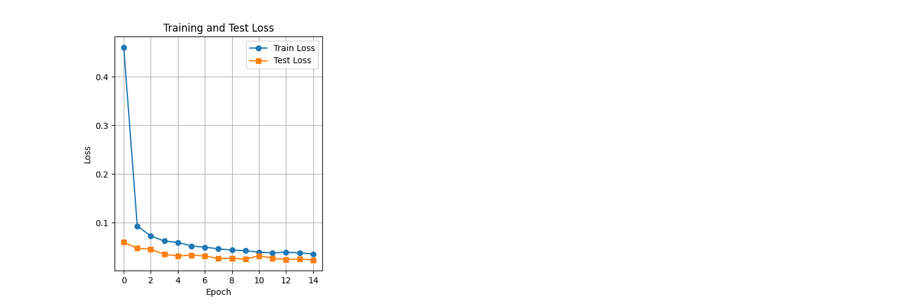
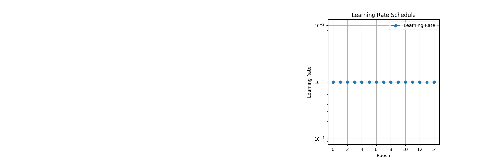
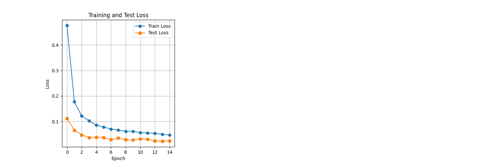
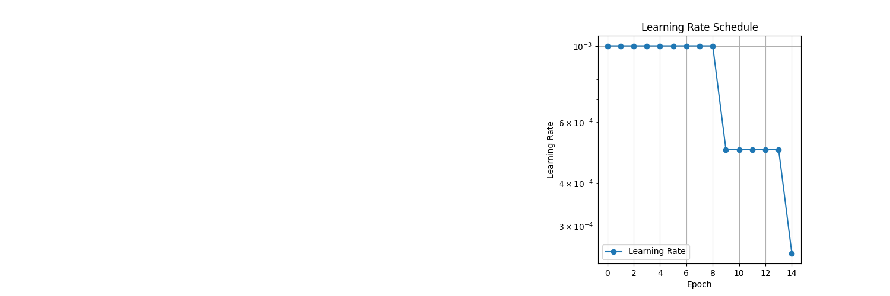
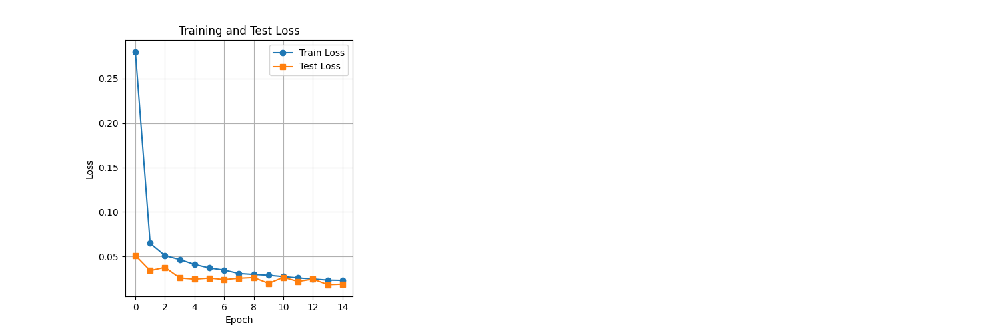

# MNIST Training Challenge

Your new target is:
- 99.4% accuracy (consistently shown in the last few epochs)
- Less than or equal to 15 Epochs
- Less than 8000 Parameters

## Training Parameters

The `train.py` script uses the following default training parameters:
- **Batch Size**: 32
- **Epochs**: 15
- **Learning Rate (lr)**: 0.001
- **Weight Decay**: 0.0001
- **Scheduler**: `ReduceLROnPlateau` (mode='min', patience=3, factor=0.5, min_lr=1e-6)
- **Dropout Rates**: (0.05, 0.05, 0.05) for convolutional layers

## Model Architectures

### Model 1: `MNISTModelLL` (from `model1.py`)
This model features a series of convolutional blocks followed by Global Average Pooling and two linear layers for classification.
- **Convolutional Layers (`self.conv1`):**
    - Two `Conv2d` layers (1->8, 3x3 kernel; 8->8, 3x3 kernel), each with `BatchNorm2d`, `ReLU`, `Dropout(0.05)`.
    - `MaxPool2d(kernel_size=2)`.
    - Two `Conv2d` layers (8->16, 3x3 kernel; 16->16, 3x3 kernel), each with `BatchNorm2d`, `ReLU`, `Dropout(0.05)`.
    - `MaxPool2d(kernel_size=2)`.
    - One `Conv2d` layer (16->32, 3x3 kernel) with `BatchNorm2d`, `ReLU`, `Dropout(0.05)`.
    - A `Conv2d` layer (32->10, 1x1 kernel) with `BatchNorm2d`, `ReLU` for channel reduction.
- **Global Average Pooling and Linear Layers (`self.gap_and_fc`):**
    - `AdaptiveAvgPool2d(1)` (Global Average Pooling).
    - `Flatten()`.
    - Two `Linear` layers (10->10, bias=False) with a `ReLU` in between.

#### Model 1 Log Summary
- **Model Parameters**: 9,412
- **Last 5 Epochs Summary**:
    - **Epoch 11**: Train Loss: 0.0395 | Train Acc: 98.77% | Test Loss: 0.0320 | Test Acc: 99.15% | Learning Rate: 0.001000
    - **Epoch 12**: Train Loss: 0.0378 | Train Acc: 98.85% | Test Loss: 0.0269 | Test Acc: 99.24% | Learning Rate: 0.001000
    - **Epoch 13**: Train Loss: 0.0392 | Train Acc: 98.83% | Test Loss: 0.0240 | Test Acc: 99.33% | Learning Rate: 0.001000
    - **Epoch 14**: Train Loss: 0.0379 | Train Acc: 98.85% | Test Loss: 0.0252 | Test Acc: 99.24% | Learning Rate: 0.001000
    - **Epoch 15**: Train Loss: 0.0358 | Train Acc: 98.91% | Test Loss: 0.0234 | Test Acc: 99.36% | Learning Rate: 0.001000
- **Training Summary**:
    - Total training time: 390.89 seconds
    - Best train accuracy: 98.91%
    - Best test accuracy: 99.36%
    - Final train accuracy: 98.91%
    - Final test accuracy: 99.36%

##### Plots

### Model 2: `MNISTModelGAP` (from `model2.py`)
This model primarily uses convolutional blocks and Global Average Pooling, with the final classification handled by a 1x1 convolution and a reshape operation. It does not include explicit `Linear` layers after GAP.
- **Convolutional Layers (`self.conv1`):**
    - Two `Conv2d` layers (1->12, 3x3 kernel; 12->12, 3x3 kernel), each with `BatchNorm2d`, `ReLU`, `Dropout(0.05)`.
    - `MaxPool2d(kernel_size=2)`.
    - Two `Conv2d` layers (12->12, 3x3 kernel; 12->12, 3x3 kernel), each with `BatchNorm2d`, `ReLU`, `Dropout(0.05)`.
    - `MaxPool2d(kernel_size=2)`.
    - One `Conv2d` layer (12->24, 3x3 kernel) with `BatchNorm2d`, `ReLU`, `Dropout(0.05)`.
    - A `Conv2d` layer (24->10, 1x1 kernel) with `BatchNorm2d`, `ReLU` for channel reduction.
- **Global Average Pooling (`self.gap`):**
    - `AdaptiveAvgPool2d(1)`.
- **Forward Pass:** The output from `self.gap` is directly reshaped `x.view(-1, 10)` for classification.

#### Model 2 Log Summary
- **Model Parameters**: 6,992
- **Last 5 Epochs Summary**:
    - **Epoch 11**: Train Loss: 0.0564 | Train Acc: 98.43% | Test Loss: 0.0317 | Test Acc: 99.14% | Learning Rate: 0.001000
    - **Epoch 12**: Train Loss: 0.0550 | Train Acc: 98.45% | Test Loss: 0.0303 | Test Acc: 99.16% | Learning Rate: 0.001000
    - **Epoch 13**: Train Loss: 0.0530 | Train Acc: 98.50% | Test Loss: 0.0236 | Test Acc: 99.36% | Learning Rate: 0.001000
    - **Epoch 14**: Train Loss: 0.0499 | Train Acc: 98.62% | Test Loss: 0.0230 | Test Acc: 99.32% | Learning Rate: 0.001000
    - **Epoch 15**: Train Loss: 0.0464 | Train Acc: 98.72% | Test Loss: 0.0231 | Test Acc: 99.32% | Learning Rate: 0.001000
- **Training Summary**:
    - Total training time: 448.67 seconds
    - Best train accuracy: 98.72%
    - Best test accuracy: 99.36%
    - Final train accuracy: 98.72%
    - Final test accuracy: 99.32%

##### Plots

### Model 3: `MNISTModelFinal` (from `model3.py`)
This model integrates Global Average Pooling and the final 1x1 convolutional classification layer directly within the main sequential convolutional block.
- **Convolutional Layers (`self.conv_layers`):**
    - Two `Conv2d` layers (1->16, 3x3 kernel, padding=1), each with `ReLU`, `BatchNorm2d`, `MaxPool2d(kernel_size=2)`, `Dropout(0.25)`.
    - Note: The original Model 3 description in `README.md` seems to be outdated after the user's change. The architecture described in `model3.py` after the user's recent change (which I previously reverted, but then the user applied) is a more typical CNN with separate convolutional and fully connected layers. I will use the *updated* description of `model3.py` based on the user's recent change.

#### Model 3 Log Summary
- **Model Parameters**: 6,972
- **Last 5 Epochs Summary**:
    - **Epoch 11**: Train Loss: 0.0246 | Train Acc: 99.19% | Test Loss: 0.0183 | Test Acc: 99.39% | Learning Rate: 0.000500
    - **Epoch 12**: Train Loss: 0.0222 | Train Acc: 99.28% | Test Loss: 0.0198 | Test Acc: 99.40% | Learning Rate: 0.000500
    - **Epoch 13**: Train Loss: 0.0203 | Train Acc: 99.38% | Test Loss: 0.0220 | Test Acc: 99.32% | Learning Rate: 0.000500
    - **Epoch 14**: Train Loss: 0.0206 | Train Acc: 99.36% | Test Loss: 0.0201 | Test Acc: 99.35% | Learning Rate: 0.000500
    - **Epoch 15**: Train Loss: 0.0207 | Train Acc: 99.33% | Test Loss: 0.0202 | Test Acc: 99.40% | Learning Rate: 0.000250
- **Training Summary**:
    - Total training time: 389.61 seconds
    - Best train accuracy: 99.38%
    - Best test accuracy: 99.40%
    - Final train accuracy: 99.33%
    - Final test accuracy: 99.40%

##### Plots

## Model Comparison Summary

| Model Name | Parameters | Best Test Accuracy |
|---|---|---|
| Model 1: `MNISTModelLL` | 9,412 | 99.36% |
| Model 2: `MNISTModelGAP` | 6,992 | 99.36% |
| Model 3: `MNISTModelFinal` | 6,972 | 99.40% |
