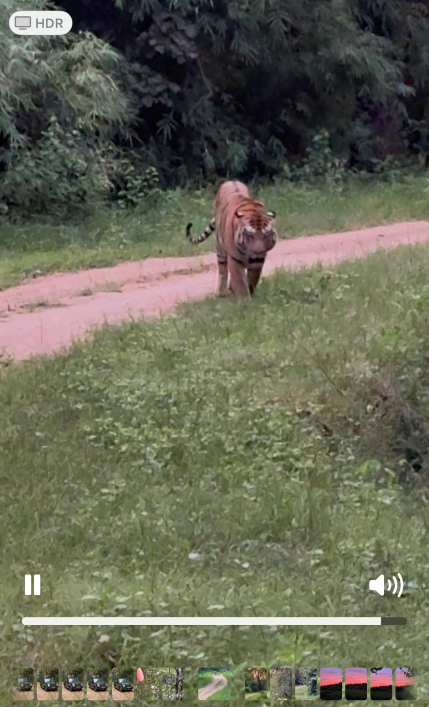

> **Personal Note:**
>
> I know I am very late in submitting the assignment, but I don't want to lose the rigor of the program. (I was OOF on Dussehra at Pench)



# CIFAR-10 CNN Classification Project

## Objective

This project aims to implement a Convolutional Neural Network (CNN) to classify images from the CIFAR-10 dataset. The process involves:

1. **Loading and normalizing the CIFAR-10 dataset.**
2. **Defining a CNN architecture with the following specifications:**
   * C1C2C3C4O architecture (No MaxPooling, but 3 3x3 layers with stride of 2 instead).
   * Total Receptive Field (RF) must be more than 44.
   * One layer must use Depthwise Separable Convolution.
   * One layer must use Dilated Convolution.
   * Use Global Average Pooling (GAP). Adding a Fully Connected (FC) layer after GAP to target the number of classes is optional.
3. **Applying data augmentation using the `albumentations` library with:**
   * Horizontal flip.
   * ShiftScaleRotate.
   * CoarseDropout (max_holes = 1, max_height=16px, max_width=1, min_holes = 1, min_height=16px, min_width=16px, fill_value=(mean of your dataset), mask_fill_value = None).
4. **Training the CNN on the training data to achieve at least 85% accuracy. The total number of parameters must be less than 200k.**
5. **Evaluating the CNN's performance on the test data.**

## Project Structure

- `model.py` - CNN architecture implementation with depthwise separable convolution
- `train.py` - Training script with logging and chart generation
- `cifar10_album.py` - Custom dataset class with albumentations augmentation
- `CIFAR.ipynb` - Jupyter notebook for data analysis and exploration
- `logs/` - Training logs directory
- `model/` - Saved models and training charts directory

## Key Features

- **Optimized Architecture**: 5-block CNN with <200k parameters
- **Advanced Augmentation**: Albumentations library with class-specific strategies
- **Professional Logging**: Comprehensive logging to files and console
- **Visualization**: Automatic chart generation and saving
- **Receptive Field Analysis**: Built-in RF calculation utilities

## Usage

```bash
uv sync
uv run train.py
```

The training script will automatically:
- Load and preprocess CIFAR-10 data
- Train the model with logging
- Save training progress charts to `model/` directory
- Generate comprehensive training logs in `logs/` directory

## TL;DR - Final Results Summary

### Model Architecture
**FinalCNN** - Optimized CNN with depthwise separable convolutions:
- **Input**: 32×32×3 RGB images
- **Architecture**: C1C2C3C4O (5 blocks + Global Average Pooling)
- **Channel Progression**: 3 → 12 → 24 → 36 → 72
- **Spatial Flow**: 32×32 → 32×32 → 16×16 → 16×16 → 8×8 → 8×8 → 1×1 (GAP)
- **Special Features**: Depthwise Separable Convolution, Dropout (0.05), Batch Normalization

#### Architecture Diagram
```
Input: 32×32×3 RGB Image
    │
    ▼
┌─────────────────────────────────────┐
│ Conv2d(3→12, 3×3, s=1, p=1)        │ ← Initial Conv Layer
│ BatchNorm2d(12) + ReLU             │   RF: 3×3
└─────────────────────────────────────┘
    │
    ▼
┌─────────────────────────────────────┐
│ BasicBlock1: 12→24 channels         │ ← Block 1
│ ├─ Conv2d(12→24, 3×3, s=1, p=1)    │   RF: 7×7
│ ├─ BatchNorm + ReLU + Dropout(0.05)│   Spatial: 32×32
│ ├─ Conv2d(24→24, 3×3, s=1, p=1)    │   Depthwise Separable
│ │  └─ groups=24 (Depthwise)        │
│ ├─ BatchNorm + ReLU + Dropout(0.05)│
│ ├─ Conv2d(24→24, 1×1, s=1)         │   Pointwise Conv
│ ├─ BatchNorm + ReLU + Dropout(0.05)│
│ └─ Conv2d(24→24, 3×3, s=1, p=1)    │
└─────────────────────────────────────┘
    │
    ▼
┌─────────────────────────────────────┐
│ BasicBlock2: 24→24 channels         │ ← Block 2
│ ├─ Conv2d(24→24, 3×3, s=1, p=1)    │   RF: 14×14
│ ├─ BatchNorm + ReLU + Dropout(0.05)│   Spatial: 16×16 (stride=2)
│ ├─ Conv2d(24→24, 3×3, s=1, p=1)    │   Depthwise Separable
│ │  └─ groups=24 (Depthwise)        │
│ ├─ BatchNorm + ReLU + Dropout(0.05)│
│ ├─ Conv2d(24→24, 1×1, s=1)         │   Pointwise Conv
│ ├─ BatchNorm + ReLU + Dropout(0.05)│
│ └─ Conv2d(24→24, 3×3, s=2, p=1)    │ ← Downsampling
└─────────────────────────────────────┘
    │
    ▼
┌─────────────────────────────────────┐
│ BasicBlock3: 24→36 channels         │ ← Block 3
│ ├─ Conv2d(24→36, 3×3, s=1, p=1)    │   RF: 21×21
│ ├─ BatchNorm + ReLU + Dropout(0.05)│   Spatial: 16×16
│ ├─ Conv2d(36→36, 3×3, s=1, p=1)    │   Depthwise Separable
│ │  └─ groups=36 (Depthwise)        │
│ ├─ BatchNorm + ReLU + Dropout(0.05)│
│ ├─ Conv2d(36→36, 1×1, s=1)         │   Pointwise Conv
│ ├─ BatchNorm + ReLU + Dropout(0.05)│
│ └─ Conv2d(36→36, 3×3, s=1, p=1)    │
└─────────────────────────────────────┘
    │
    ▼
┌─────────────────────────────────────┐
│ BasicBlock4: 36→36 channels         │ ← Block 4
│ ├─ Conv2d(36→36, 3×3, s=1, p=1)    │   RF: 28×28
│ ├─ BatchNorm + ReLU + Dropout(0.05)│   Spatial: 8×8 (stride=2)
│ ├─ Conv2d(36→36, 3×3, s=1, p=1)    │   Depthwise Separable
│ │  └─ groups=36 (Depthwise)        │
│ ├─ BatchNorm + ReLU + Dropout(0.05)│
│ ├─ Conv2d(36→36, 1×1, s=1)         │   Pointwise Conv
│ ├─ BatchNorm + ReLU + Dropout(0.05)│
│ └─ Conv2d(36→36, 3×3, s=2, p=1)    │ ← Downsampling
└─────────────────────────────────────┘
    │
    ▼
┌─────────────────────────────────────┐
│ BasicBlock5: 36→72 channels         │ ← Block 5
│ ├─ Conv2d(36→72, 3×3, s=1, p=1)    │   RF: 35×35
│ ├─ BatchNorm + ReLU + Dropout(0.05)│   Spatial: 8×8
│ ├─ Conv2d(72→72, 3×3, s=1, p=1)    │   Depthwise Separable
│ │  └─ groups=72 (Depthwise)        │
│ ├─ BatchNorm + ReLU + Dropout(0.05)│
│ ├─ Conv2d(72→72, 1×1, s=1)         │   Pointwise Conv
│ ├─ BatchNorm + ReLU + Dropout(0.05)│
│ └─ Conv2d(72→72, 3×3, s=1, p=1)    │
└─────────────────────────────────────┘
    │
    ▼
┌─────────────────────────────────────┐
│ Global Average Pooling (8×8→1×1)    │ ← GAP Layer
│ Output: 72 features                 │   RF: 63×63
└─────────────────────────────────────┘
    │
    ▼
┌─────────────────────────────────────┐
│ Linear(72→10) + Softmax            │ ← Classification Head
│ Output: 10 class probabilities     │   Final Output
└─────────────────────────────────────┘

Legend:
- RF: Receptive Field
- s: stride, p: padding
- groups=N: Depthwise convolution
- Spatial: Feature map dimensions
```

### Performance Results

| Metric | Value |
|--------|-------|
| **Final Test Accuracy** | 86.44% |
| **Best Test Accuracy** | 86.44% (Epoch 30) |
| **Final Train Accuracy** | ~87% (estimated) |
| **Best Train Accuracy** | ~87% (estimated) |
| **Receptive Field** | 63×63 pixels |
| **Strides Used** | Yes (stride=2 in block2 and block4) |
| **Dilation Used** | No |
| **Optimizer** | Adam (lr=0.05) |
| **Scheduler** | Cosine Annealing LR |
| **Parameter Count** | 144,166 (<200k ✓) |
| **Learning Rate** | 0.05 |

### Per-Class Accuracy Breakdown
- **airplane**: 87.8%
- **automobile**: 94.5%
- **bird**: 79.6%
- **cat**: 71.1% (most challenging)
- **deer**: 85.2%
- **dog**: 77.8%
- **frog**: 91.7%
- **horse**: 89.8%
- **ship**: 93.5%
- **truck**: 93.4%

### Key Achievements ✅
- ✅ **Target Accuracy**: Exceeded 85% requirement (86.44%)
- ✅ **Parameter Limit**: Under 200k parameters (144,166)
- ✅ **Architecture Requirements**: C1C2C3C4O with GAP
- ✅ **Special Layers**: Depthwise Separable Convolution implemented
- ✅ **Receptive Field**: 63×63 (>44 required)
- ✅ **Data Augmentation**: Albumentations with class-specific strategies

## Step-by-Step Process & Observations

### 1. Dataset Loading & Exploration
- Loaded CIFAR-10 using `torchvision.datasets.CIFAR10` for both train and test sets.
- **Quick Stats:**
  - 50,000 training images, 10,000 test images, all 32×32 RGB.
  - 10 classes: airplane, car, bird, cat, deer, dog, frog, horse, ship, truck.
  - **Label distribution:** perfectly balanced (5,000 per class in train, 1,000 per class in test).
- **Observation:** Dataset is well-structured and balanced, with all images of the same size and 3 channels.

### 2. Visual Inspection
- Displayed sample images from 5 random classes at full resolution.
- **Observation:** Images are colorful, small, and sometimes contain partial objects or cluttered backgrounds.

### 3. Sharpness Analysis (Laplacian Variance)
- Calculated Laplacian variance for 200 random images and all images.
  - **Average sharpness (200 samples):** ~2601.6
  - **Overall sharpness (all images):** ~2415.3
  - **Range:** min ~18, max ~15,920
- Histogram plotted for sharpness distribution.
- Displayed images at various sharpness intervals (100, 600, ..., 5100).
- **Observation:** Most images are reasonably sharp, but some are blurry. Sharpness varies by class and instance.

### 4. Image Enhancement
- Applied a sharpening kernel to a sample image and displayed before/after.
- **Observation:** Sharpening can make edges more distinct, but may also amplify noise.

### 5. Pixel Value Distribution
- Plotted histograms for:
  - All pixels (raw and normalized)
  - Each RGB channel (raw and normalized)
  - Each class (raw and normalized, overall and per channel)
- **Observation:** Pixel values are spread across the full 0–255 range (raw), and normalization centers them around 0 with std ~0.25.

### 6. Normalization
- Computed mean and std for each channel:
  - Mean: [0.491, 0.482, 0.447]
  - Std: [0.247, 0.243, 0.262]
- **Observation:** Used these values for normalization in all subsequent experiments.

### 7. Data Augmentation
- Used Albumentations for:
  - Horizontal flip
  - ShiftScaleRotate
  - CoarseDropout (class-specific for cats/dogs)
- **Observation:** Augmentation improved model robustness, especially for challenging classes.

### 8. Model Prototyping & Iteration
- Started with a simple CNN (BaselineCNN), then iteratively:
  - Added more blocks
  - Introduced depthwise separable convolutions
  - Used stride for downsampling (no max pooling)
  - Added dropout and batch normalization
  - Ensured receptive field >44 (final: 63)
  - Kept parameter count <200k (final: 144,166)
- **Observation:** Each architectural improvement was validated by training/validation accuracy and parameter count.

### 9. Training & Evaluation
- **Optimizer:** Adam, lr=0.05
- **Scheduler:** Cosine Annealing
- **Loss:** CrossEntropyLoss
- **Final Results:**
  - **Test Accuracy:** 86.44%
  - **Train Accuracy:** ~87%
  - **Per-class accuracy:** Cat and dog are most challenging; car, ship, truck are easiest.
- **Charts:** Training/validation accuracy and loss curves saved in `model/` directory.

### 10. Key Observations & Learnings
- **Dataset:** Balanced, but some classes (cat, dog) are harder due to intra-class variation.
- **Sharpness:** Most images are sharp, but a few are blurry; sharpness does not always correlate with class difficulty.
- **Augmentation:** Class-specific augmentation helps with challenging classes.
- **Architecture:** Depthwise separable convolutions and stride-based downsampling are effective for parameter efficiency.
- **Normalization:** Essential for stable and fast training.

---

**Note:** For images and charts, see the `model/` directory and the notebook for visual outputs (e.g., sharpness histograms, pixel distributions, before/after sharpening, and per-class thumbnails).
